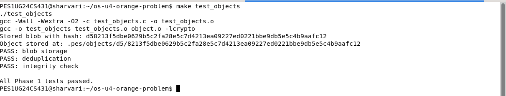
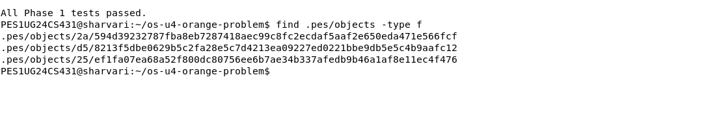
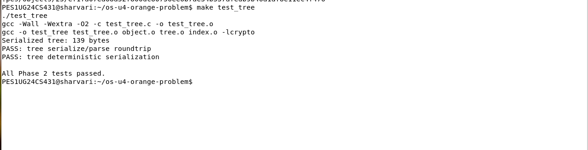
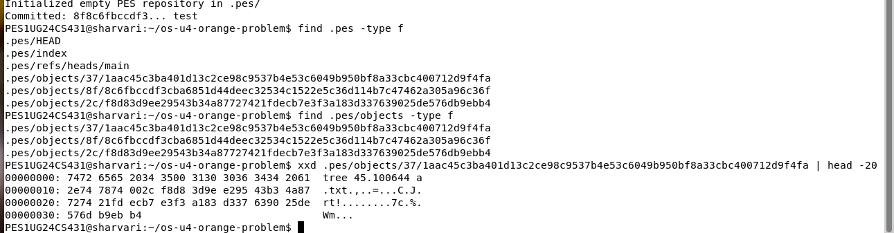
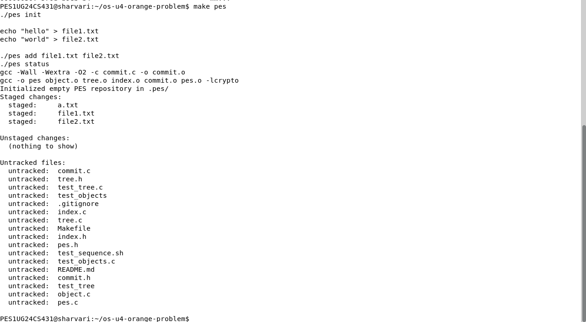
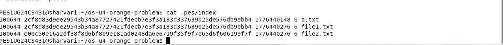
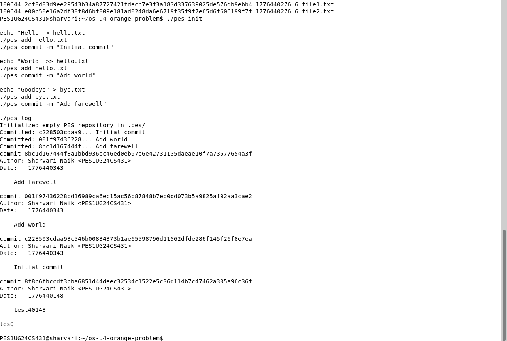
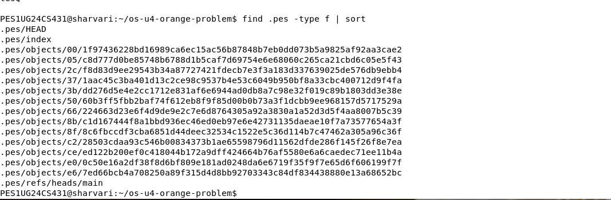
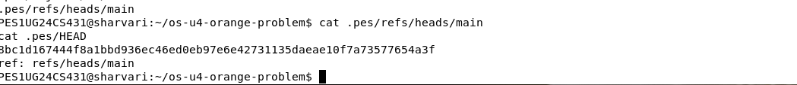
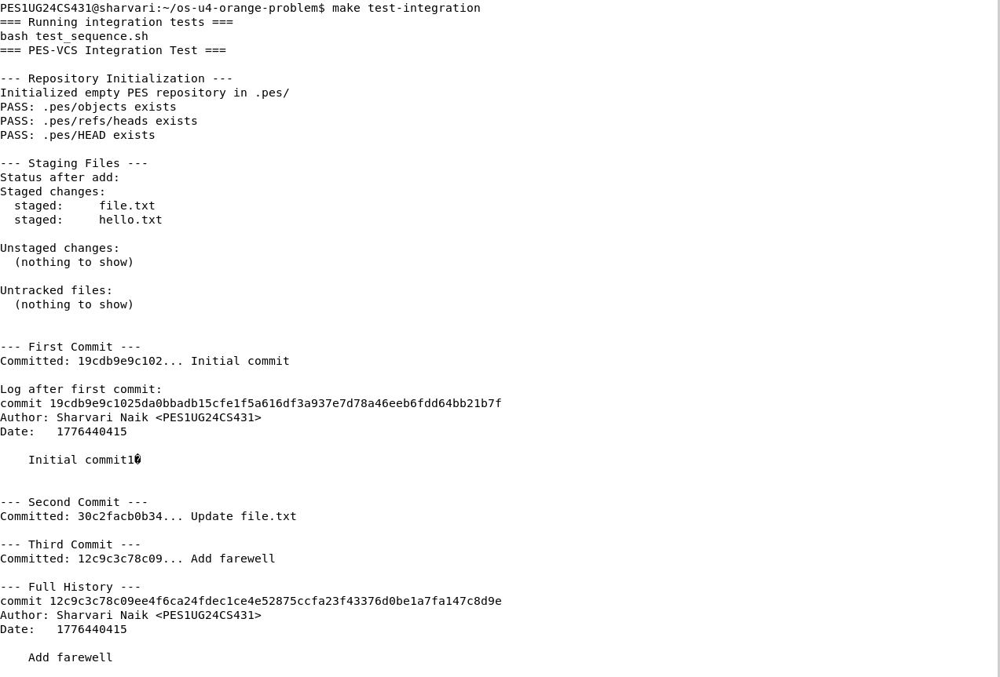

## Name: Sharvari Naik

## SRN: PES1UG24CS431

---

## Phase 1: Object Storage

### Screenshot 1A – test_objects Output

### Screenshot 1B – Object Store Structure

---

## Phase 2: Tree Objects

### Screenshot 2A – test_tree Output

### Screenshot 2B – Raw Tree Object (xxd)

---

## Phase 3: Index (Staging Area)

### Screenshot 3A – pes init, add, and status

### Screenshot 3B – .pes/index File

---

## Phase 4: Commits and History

### Screenshot 4A – pes log Output

### Screenshot 4B – .pes Directory Structure

### Screenshot 4C – HEAD and Branch Reference

---

## Final Integration Test

### Screenshot – make test-integration

---

## Analysis Answers

### Q5.1 – Checkout

A checkout operation updates the `.pes/HEAD` file to point to a specific branch reference. The working directory is then updated to match the tree of the selected commit by replacing files accordingly.

This operation is complex because it must ensure that uncommitted changes are not lost while switching branches and requires reconstructing the working directory from stored tree objects.

---

### Q5.2 – Dirty Working Directory

To detect conflicts, the system compares the working directory, the index, and the target commit tree.

If a file has been modified in the working directory and differs from both the index and the target tree, it indicates uncommitted changes. In such cases, checkout must be aborted to prevent overwriting user changes.

---

### Q5.3 – Detached HEAD

In a detached HEAD state, HEAD points directly to a commit instead of a branch. New commits created in this state are not associated with any branch and may be lost if not referenced.

To recover such commits, the user can create a new branch pointing to the current commit.

---

### Q6.1 – Garbage Collection

Garbage collection identifies unreachable objects by starting from all branch heads and traversing all commits, trees, and blobs recursively.

A graph traversal using DFS or BFS with a hash set is used to track visited objects efficiently.

In large repositories, most objects remain reachable, so traversal involves visiting a large portion of stored objects.

---

### Q6.2 – GC Race Condition

Running garbage collection concurrently with commit operations is dangerous because objects may be deleted before being referenced.

For example, a blob created during a commit may not yet be linked, and garbage collection may remove it incorrectly.

Git avoids this issue using locking mechanisms and by ensuring garbage collection runs only when no concurrent writes are occurring.

---

## Conclusion

This project demonstrates the implementation of a simplified version control system using content-addressable storage, tree structures, indexing, and commit history management.

